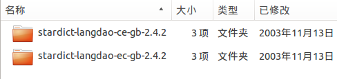
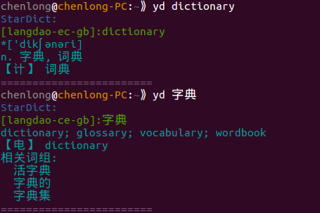
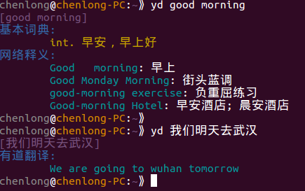
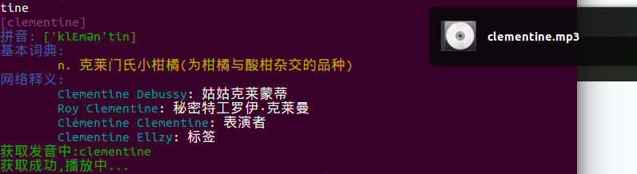

#youdao
###简介
这是一个基于Python 在控制台下查单词的小工具。
这个小程序是受<https://github.com/Flowerowl/ici> 启发， 用requests 库和有道的API 重新实现的，后期加上了数据库、有道Web版、有道翻译、单词发音、Stardict 的支持。

__从0.3.0开始添加了对Stardict 的支持__（使用pystardict + C扩展加快查询速度）。默认情况下使用Stardict查询单词，如果没有找到则使用web版有道词典。
另外，它还支持__单词发音__（须要联网从有道获取，会缓存已经获取的mp3文件）；支持__有道翻译__，支持使用有道API查词；自动使用sqlite 数据库保存已经查询过的单词数据。

###使用说明
+ __Stardict 设置__
1. __下载词典：__Stardict 是一个跨平台的国际词典软件，提供大量词库使用（可以去  <http://pan.baidu.com/s/1dD1mIRJ> 下载，推荐21世纪双语词典，当然也可以从网上找～ 但是不要下太多不然查询速度是个问题= =）
2. __解压：__新建一个文件夹比如`/home/chenlong/.dict_youdao/stardict`，将下载的词典解压到该目录下：

3. __在程序中设置：__使用命令
`yd -s "/home/chenlong/.dict_youdao/stardict"`
成功后输出：
`stardict 路径设置成功： /home/chenlong/.dict_youdao/stardict`
4. 尽情使用stardict 吧


+ __使用有道词典__
可能你不喜欢stardict（版权问题、颜色单一），那么可以按照上面的方法将stardict 的目录设置为空或者一个没有词典的空目录（一定是__空目录__）。
此时，程序将默认使用有道Web 版获取单词解释，对于没有解释的单词将自动使用有道翻译。
设置完成后使用`yd keyword`查词


+ __单词发音__
使用命令 `yd -v keyword`会在查询单词后获取单词发音，下载的单词发音保存在`~/.dict_youdao/voice`下，采用系统默认播放器播放。在Linux 下推荐使用Clementine 播放器，播放时不会弹出新窗口。

另外，查询单词后，使用`yd -v` 会自动获取上一个查询单词的发音。

+ __管理缓存单词__
查询过的单词都使用sqlite 数据库保存，数据库文件在`~/.dict_youdao`。
`yd -l` ：列出数据库中的单词以及查询次数。
`yd -c` ：清空数据库以及保存的发音。
`yd -d keyword` ：删除某个单词


###使用帮助
```yd [-a] [-n] [-l] [-c] [-v] [-d word] [-y] [-s path] [--help] word
    [-a] 使用API 而不是解析网页获取结果
    [-n] 强制重新获取, 不管数据库中是否已经保存
    [-l] 列出数据库中保存的所有单词
    [-c] 清空数据库
    [-v] 获取单词发音, 单独使用 yd -v 可以获取上一个查询单词的发音
    [-d word] 删除数据库中某个单词
    [-y] 优先使用有道词典
    [-s path] 设置stardict词典路径
    [--help] 显示帮助信息```
    
###安装
+ Ubuntu（Linux）：
`sudo python setup.py install`
或者
`sudo pip install youdao`

+ Windows：
由于Windows 下控制台下的编码问题，推荐使用[cmder](http://gooseberrycreative.com/cmder/)，并在`cmder/vendor/init.bat` 的最后加上
```
@chcp 65001 > nul
@set PYTHONIOENCODING=utf-8```
安装过程中可能须要vc 或gcc

###更新历史
+ 0.3.0 增加对stardict 的支持，使用[pystardict](https://github.com/lig/pystardict)，为加速查询编写了查询索引部分的C 扩展
+ 0.2.3 修复了使用api无法显示新单词结果的问题
+ 0.2.1 修复了无法显示已查询的单词的bug
+ 0.2.0 重新组织了代码结构以及数据库字段, 所以将丢失以前保存的单词
+ 0.1.5 添加获取单词发音的功能
+ 0.1.4 添加删除数据库中保存的单词的功能, 添加帮助说明
+ 0.1.3 抓取过的单词使用sqlite保存
+ 0.1.2 增加抓取web版有道词典页面的方法查词, 并默认使用这种方法. 可以通过 -a 选项使用api查词.
+ 0.1.1 改变查词方法为 yd keyword
+ 0.1.0 完成基本功能, 使用命令 youdao keyword 查词.