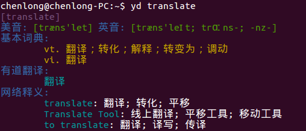
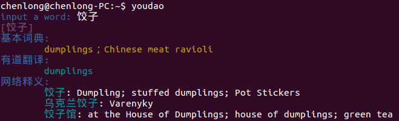

#youdao
基于Python 在控制台下查单词的小工具，基于有道词典API。
受<https://github.com/Flowerowl/ici> 启发，用requests 库和有道的API 写一遍练习一下。

由于有道api需要鉴权,查询速度受到影响,所以增加了抓取web版有道词典的方法进行查词,默认使用这种方法.
使用Beautifulsoup 库解析网页数据,生成和api类似的dict.

###更新历史
+ 0.1.2 增加抓取web版有道词典页面的方法查词, 并默认使用这种方法. 可以通过 -a 选项使用api查词.
+ 0.1.1 改变查词方法为 yd keyword
+ 0.1.0 完成基本功能, 使用命令 youdao keyword 查词.

###1.运行效果
支持中文，句子翻译

	$ yd keyword

	$ yd
		input a word: 饺子

###2.安装

	sudo python setup.py install
安装好后在控制台直接调用yd 或者 yd keyword 即可

###3.设置自己的API key
一个key 每分钟只能发起1000次请求，可以去有道自行申请一个API key，地址：
<http://fanyi.youdao.com/openapi?path=data-mode>

修改youdao.py 中如下部分即可

	params = {
        'keyfrom': 'longcwang',
        'key': '131895274',
        'type': 'data',
        'doctype': 'json',
        'version': '1.1',
        'q': 'query'
	    }